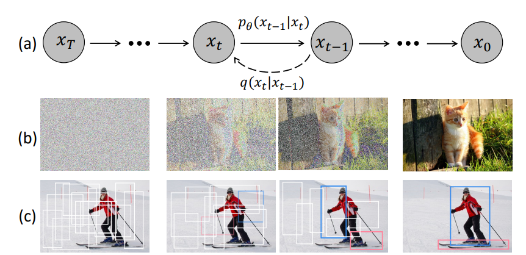
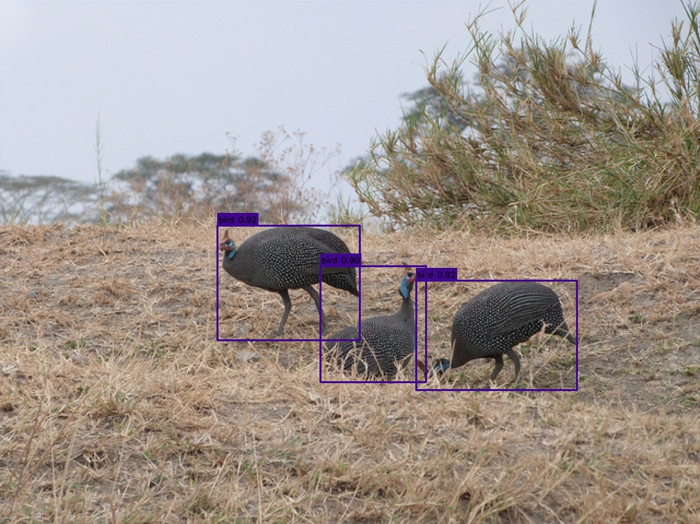
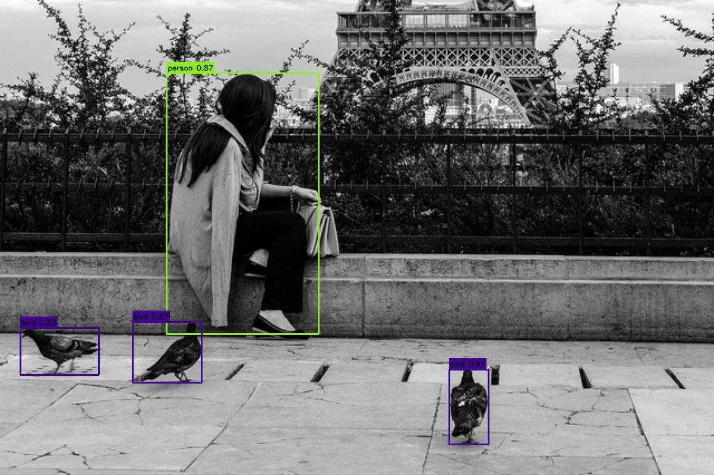
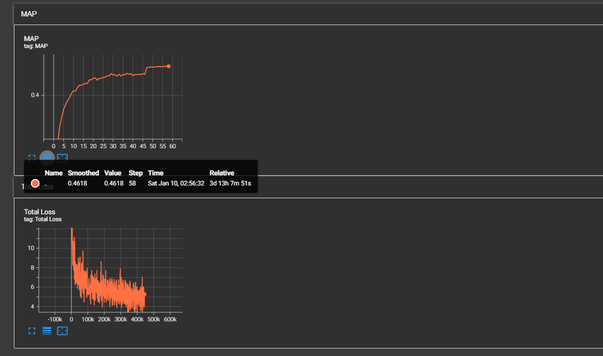

## DiffusionDet-PyTorch

A PyTorch re-implementation of **DiffusionDet**  
Paper: https://arxiv.org/abs/2211.09788



---

### Requirements
- Python >= 3.8
- PyTorch >= 1.5.0
- Detectron2

---

### Properties of this repo
- [x] Built on Detectron2
- [x] Supports resume training from checkpoints
- [x] Multi-GPU training via Distributed Data Parallel (DDP)
- [x] Refactored codebase with improved modularity and readability

---

### TODO
- [ ] Experiments with Flow Matching
- [ ] Experiments with Flow Matching (back to basics)
- [ ] torch-run 

---

### Repository Structure  
```
script/
├── test.py
├── train.py
src/
├── model/
├── dataset/
├── engine/
├── utils/
```

---

### Train
```
python src/train.py 
```

#### Training parameter
- leraning rate : $2.5 \times 10^{-5}$
- weight decay : $10^{-4}$
- total iterations : 450,000 (450K)
- total epochs : 61 (47, 57 - step lr decay)
- batch size : 16 
- optimizer : AdamW
- signal scale : 2.0

#### Test parameter
- iteration step : 4
- num eval boxes : 500

---

### Evaluation 

- quantitative results

|methods                    | iter step | num eval boxes | Resolution.  | AP        | FPS   |
|---------------------------|-----------| -------------- | ------------ | --------- | ----- |
|papers                     |    1      |  300           | 800 ~ 1333   | 45.8      | -     |
|papers                     |    1      |  500           | 800 ~ 1333   | 46.3      | -     |
|papers                     |    4      |  300           | 800 ~ 1333   | 46.6      | -     |
|papers                     |    4      |  500           | 800 ~ 1333   | **46.8**  | -     |
|this repo                  |    4      |  500           | 800 ~ 1333   | 46.2      | -     |
|this repo (wo box renewal) |    4      |  500           | 800 ~ 1333   | 45.7      | -     |

- qualitative results




---

### Visualization (TensorBoard)
```
tensorboard --logdir=./runs
```



