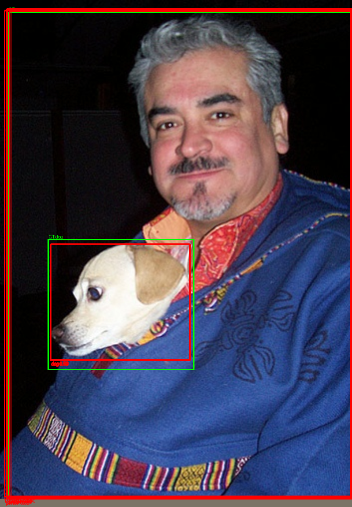
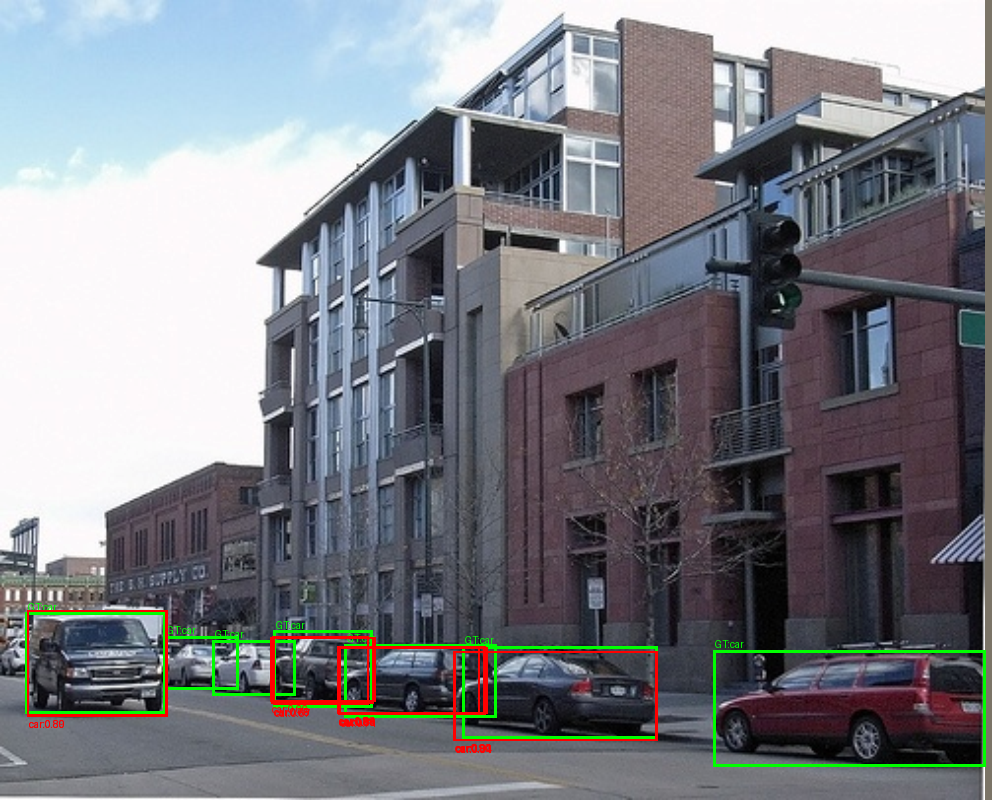
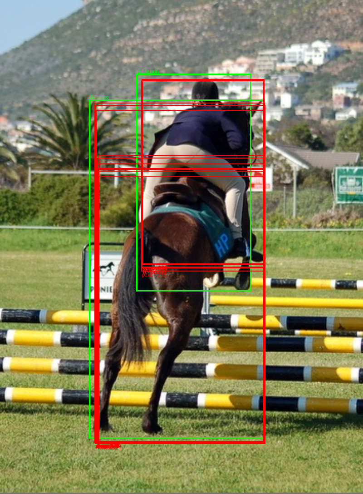
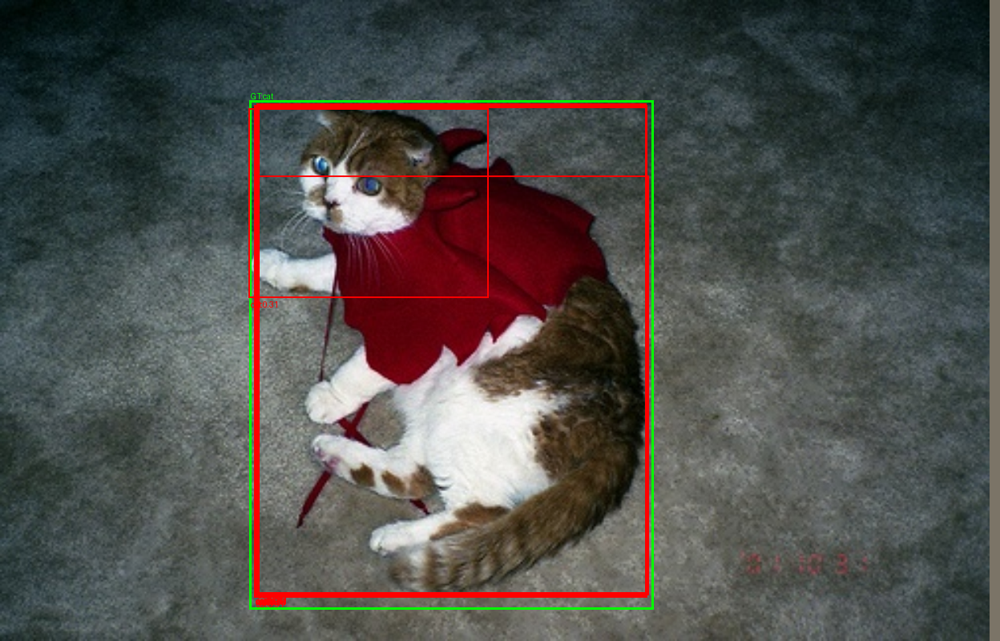

# fm-det

DiffusionDet 를 detectron2 없이 처음부터 재구현하고, 그 위에서 **diffusion → flow matching** 단계적으로 전환하면서 encoder/decoder/head/sampler/loss 의 ablation 으로 detection 에서 실제로 유효한 구성 요소를 정리하는 연구 프로젝트.

> 산출물은 가중치가 아니라 **표에 채워진 결론** — DiffusionDet/FM 의 내부 동작을 직접 손으로 이해하는 것이 목표 ([docs/PRD.md](docs/PRD.md)).

---

## Architecture (요약)

```
  Image [B,3,H,W]
       │
       ▼
  ┌──────────────────┐
  │ Backbone         │  ResNet50 + FPN  (p2..p5 [B,256,Hi,Wi])
  └────────┬─────────┘
           ▼
  ┌──────────────────┐
  │ Sampler          │  cosine β schedule, T=1000, DDIM eta=0
  │  - 학습: GT + noise → noisy boxes
  │  - 평가: random Gaussian → DDIM 4 step denoise
  └────────┬─────────┘
           ▼
  ┌──────────────────┐
  │ Decoder (×6)     │  iterative refinement, deep supervision
  │  각 head:        │  RoIAlign → Self-Attn → DynamicConv → FFN → FiLM(time)
  │                  │  → cls + box delta → 다음 head 의 boxes
  └────────┬─────────┘
           ▼
  ┌──────────────────┐
  │ Set Loss         │  Hungarian matching + focal cls + L1 + GIoU
  │ (6 head 모두)    │  deep supervision (학습), 마지막 head 만 (평가)
  └──────────────────┘
```

자세한 stage-by-stage: [models/README.md](models/README.md) · [models/study_model.md](models/study_model.md).

---

## Training Setting

| 항목 | VOC | COCO |
|------|-----|------|
| batch size | 32 | 16 |
| optimizer | AdamW | AdamW |
| epoch | 60 | 61 |
| initial learning rate | 2.5e-5 | 2.5e-5 |
| weight decay | 1e-4 | 1e-4 |
| scheduler | MultiStepLR [47, 57] γ=0.1 | MultiStepLR [47, 57] γ=0.1 |
| warmup | 1000 iter × factor 0.01 | 1000 iter × factor 0.01 |
| grad_clip | 1.0 | 1.0 |
| AMP | bfloat16 (Blackwell native) | bfloat16 |
| seed | 42 | 42 |
| train split | VOC2007 trainval + VOC2012 trainval | COCO train2017 |
| eval split | VOC2007 test | COCO val2017 |
| input resolution | short=800, max=1333 (전통 detection 해상도) | short=800, max=1333 |
| num_proposals | 500 | 500 |
| num_heads | 6 (deep supervision) | 6 |
| signal_scale | 2.0 | 2.0 |

### lr schedule

| Epochs | Learning rate |
|--------|---------------|
| 0      | warmup: 2.5e-7 → 2.5e-5 (1000 iter linear, factor 0.01) |
| 0–46   | 2.5e-5 |
| 47–56  | 2.5e-6 (×0.1 at milestone 47) |
| 57–60  | 2.5e-7 (×0.1 at milestone 57) |

---

## Results

### VOC

| methods | Training Dataset | Testing Dataset | Resolution | AP50 |
|---------|------------------|-----------------|------------|------|
| Faster R-CNN (참고) | 2007 + 2012 | 2007 | ~600 | 73.2 |
| DETR (참고) | 2007 + 2012 | 2007 | short=800 | 69.5 |
| DiffusionDet (paper) | — | — | — | (VOC baseline 없음) |
| **ours** (epoch 26/60, mid-train) | 2007 + 2012 | 2007 | short=800 | **25.00** |
| ours (학습 완료 후 목표) | 2007 + 2012 | 2007 | short=800 | 50~70 (예상) |

per-class AP (epoch 26 / 60, last.pt, fix 후 — full eval 4,952 장):

```
25.90% = aeroplane AP
28.78% = bicycle AP
24.93% = bird AP
21.68% = boat AP
21.33% = bottle AP
23.39% = bus AP
26.87% = car AP
28.34% = cat AP
20.58% = chair AP
26.61% = cow AP
18.92% = diningtable AP
27.63% = dog AP
27.08% = horse AP
27.15% = motorbike AP
29.66% = person AP
21.74% = pottedplant AP
26.86% = sheep AP
19.61% = sofa AP
25.63% = train AP
27.40% = tvmonitor AP
mAP = 25.00%
```

> 모든 클래스 0.19~0.30 범위에 균등 — 한 클래스 stuck 없이 골고루 학습. 학습 epoch 26 / 60 (43% 진행) + lr decay 미적용 상태의 mid-train 결과. 다음 milestone (epoch 47, lr ×0.1) 에서 추가 boost 예상.

### Loss 진행 (VOC, 학습 중)

| epoch | iter | loss_total | lr |
|-------|------|------------|-----|
| 0 | 1 | 38.95 | 2.5e-7 (warmup) |
| 0 | 499 | 13.38 | 1.26e-5 |
| 1 | 999 | 10.71 | 2.50e-5 |
| 3 | 1,999 | 7.60 | 2.50e-5 |
| 9 | 4,999 | 4.83 | 2.50e-5 |
| 19 | 9,999 | 3.68 | 2.50e-5 |
| 26 | 13,529 | 3.59 | 2.50e-5 |

### COCO

| methods | Training Dataset | Testing Dataset | Resolution | AP | AP50 | AP75 |
|---------|------------------|-----------------|------------|----|------|------|
| DiffusionDet (paper) | COCO train2017 | COCO val2017 | short=800 | 46.2 | 65.0 | 49.4 |
| **ours** | COCO train2017 | COCO val2017 | short=800 | TBD | TBD | TBD |

COCO 학습 시도 (모두 중단 — 다음 재시작 예정):

| 시도 | run_dir | iters | 결과 |
|------|---------|-------|------|
| 1차 | 0531 | 2,825 | NaN loss assertion (AMP fp16 overflow) |
| 2차 | 0709 | 5,825 | 동일 NaN (warmup 으로 trigger 지연) |
| 3차 | 0933 | 4,400 | SIGHUP 사망 (I-09 — 부모 Claude 세션 종료) |
| 다음 | — | — | nohup setsid detach + bf16 + decoder fix 후 재시작 대기 |

---

## Qualitative — VOC inference overlay (epoch 26)

GT = lime, prediction (score≥0.3) = red. eval coord fix (I-10) 후 같은 가중치로 추론.

| | |
|---|---|
|  <br/>**2007/000001** — 강아지/사람 (top1 person=0.902) |  <br/>**2007/000004** — 거리 차들 (top1 car=0.906) |
|  <br/>**2007/000010** — 말 + 라이더 (top1 person=0.922) |  <br/>**2007/000011** — 고양이 (top1 cat=0.914) |

전체 8 장: `runs/20260523-1416-voc-repro-baseline/debug_out/overlay_*.png`.

> 재현 도구: `phases/voc-repro-baseline/debug_eval_inference.py` — last.pt 로드 + overlay PNG + buggy/fixed mAP 비교.

---

## Start Guide

호스트에는 **Docker + NVIDIA Container Toolkit** 만 있다고 가정. 모든 명령은 dev 컨테이너 안.

```bash
# 컨테이너 띄움 + 진입
make up
make shell           # 또는: docker compose -f env_docker/docker-compose.yml exec dev bash

# 의존성 (editable install)
pip install -e .
```

### train

학습은 **반드시 detach 해서 띄움** — 부모 세션 종료 시 SIGHUP 으로 같이 죽음 (I-09).

```bash
# VOC
nohup setsid env TORCH_HOME=/workspace/fm-det/.cache/torch \
  python train.py +experiment=voc-repro-baseline seed=42 \
  > phases/voc-repro-baseline/train.log 2>&1 < /dev/null &

# COCO
nohup setsid env TORCH_HOME=/workspace/fm-det/.cache/torch \
  python train.py +experiment=coco-repro-baseline seed=42 \
  > phases/coco-repro-baseline/train.log 2>&1 < /dev/null &
```

### test (eval)

```bash
# VOC — mAP@0.5 (VOC2007 11-point interpolation)
python eval.py data=voc model=diffusiondet loss=diffusion seed=42 \
  run_dir=runs/{ts}-voc-repro-baseline \
  ckpt=runs/{ts}-voc-repro-baseline/checkpoints/last.pt

# COCO — mAP@0.5:0.95 (pycocotools COCOeval)
python eval.py data=coco model=diffusiondet loss=diffusion seed=42 \
  run_dir=runs/{ts}-coco-repro-baseline \
  ckpt=runs/{ts}-coco-repro-baseline/checkpoints/last.pt
```

### resume

```bash
nohup setsid env TORCH_HOME=/workspace/fm-det/.cache/torch \
  python train.py +experiment=voc-repro-baseline seed=42 \
  +train.resume=runs/{ts}-voc-repro-baseline/checkpoints/last.pt \
  > phases/voc-repro-baseline/train.log 2>&1 < /dev/null &
```

### inference + overlay (qualitative)

```bash
TORCH_HOME=/workspace/fm-det/.cache/torch PYTHONPATH=/workspace/fm-det \
  python phases/voc-repro-baseline/debug_eval_inference.py \
    --run_dir runs/{ts}-voc-repro-baseline \
    --num_images 8 --ckpt last.pt
# → runs/{ts}-voc-repro-baseline/debug_out/overlay_*.png
```

### TensorBoard

```bash
make tb              # http://localhost:6007  (compose 매핑 6006→6007)
```

---

## Issues — 학습 과정에서 발견된 함정

자세한 트래커: [docs/ISSUE.md](docs/ISSUE.md). 학습을 막거나 결과를 왜곡시켰던 주요 이슈.

| ID | 카테고리 | 증상 | 해결 |
|----|---------|------|------|
| **I-10** | eval | VOC mAP@0.5 ≈ 0 (epoch 0~25 내내) | `evals/voc.py` 의 pred sx,sy scaling 제거 — GT/pred 둘 다 cur 좌표 일치 |
| **I-09** | tooling | 학습 python 이 traceback 없이 갑자기 사라짐 (COCO·VOC 다회) | `nohup setsid python ... < /dev/null &` 로 PPID=1 detach 강제 |
| I-07 | setup | torch-cache named volume 이 root 소유 — pretrained 다운 실패 | `TORCH_HOME=/workspace/fm-det/.cache/torch` workaround |
| I-04 | training | AMP fp16 의 NaN loss / DiffusionDet 본 repo 재현치 미검증 | AMP fp16 → bf16 (Blackwell native), P0 진행 중 |
| R-08 | training | PyTorch sm_120 (Blackwell) 미지원 | base image → `pytorch:2.7.1-cuda12.8-cudnn9-devel` |

---

## Roadmap

1. ~~M0 부트스트래핑 + docs + 컨테이너~~ ✅
2. ~~M1 data-sanity (COCO val)~~ ✅
3. ~~M2 데이터 sanity 전체 (COCO val/train + VOC 07/12) + Hydra base + Dataset 클래스~~ ✅
4. ~~code-skeleton-loaders / model-diffusiondet / loss-diffusiondet / entrypoints-evals~~ ✅
5. **(지금)** **P0 VOC 학습** (epoch 26 / 60, resume 대기) + COCO 재시작
6. P0 COCO 재현치 매칭 (AP 46.2 ± 0.5)
7. P0a 메커니즘 진단 5 행 (signal-scale / box-renewal / iter-step / num-boxes / nms-iou)
8. P1 — diffusion → flow matching (CFM sampler) 전환 시작

---

## Docs 트라이앵글

| 무엇 | 어디 |
|------|------|
| **무엇/왜** | [docs/PRD.md](docs/PRD.md) — 한 줄 목적 + 성공 기준 (P0/P0a/P1~) |
| **어떻게** | [docs/ARCHITECTURE.md](docs/ARCHITECTURE.md) — 루트 평탄 + Hydra + env_docker |
| **왜 이 결정** | [docs/ADR.md](docs/ADR.md) — 5 개 ADR |
| **현재 상태 (덮어쓰기)** | [docs/PENSIEVE.md](docs/PENSIEVE.md) — 한 화면 컨텍스트 회복 |
| **이슈 트래커** | [docs/ISSUE.md](docs/ISSUE.md) — 진행 중 + 해결됨 누적 |
| **실험 운영** | [docs/EXPERIMENTS.md](docs/EXPERIMENTS.md) — ablation 표 + 명명 + 완료 정의 |
| 모델 카드 | [docs/MODEL_CARD.md](docs/MODEL_CARD.md) |
| 평가 프로토콜 | [docs/EVAL_PROTOCOL.md](docs/EVAL_PROTOCOL.md) |
| Hydra 학습 | [docs/HYDRA_GUIDE.md](docs/HYDRA_GUIDE.md) |
| W&B 학습 | [docs/WANDB_GUIDE.md](docs/WANDB_GUIDE.md) |

---

## 의존성

- Python 3.11 + PyTorch 2.7.1 + cu128 (sm_120 Blackwell 공식 지원)
- Hydra 1.3 + OmegaConf
- pycocotools, TensorBoard, Weights & Biases
- detectron2 **금지** (CLAUDE.md CRITICAL)

레퍼런스 (읽기 전용): [`DiffusionDet/`](DiffusionDet/) — 본 repo. 새 코드는 import 하지 않음.

---

## License

Research/study purpose. Reference DiffusionDet © 원저자 (Apache 2.0).
