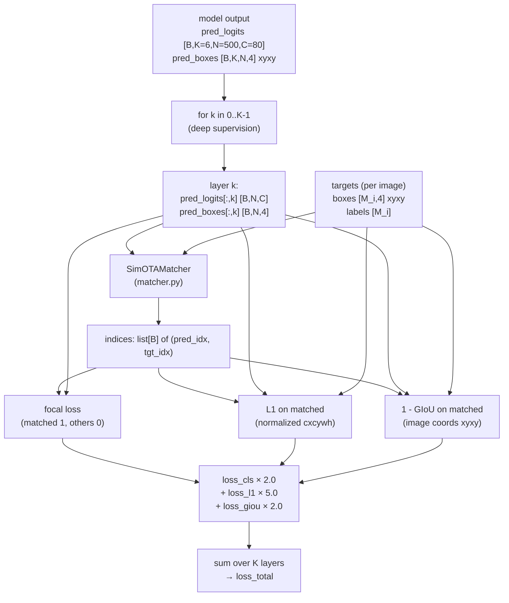
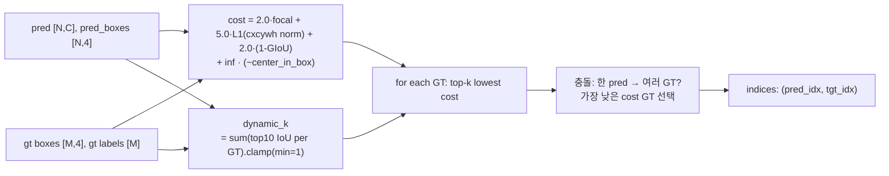

# losses/ — DiffusionDet SetCriterion

`detectron2` 없이 PyTorch + `torchvision.ops.generalized_box_iou` 만 사용.

## 전체 흐름 (gt ↔ pred → loss)

## SimOTAMatcher 내부

## Loss 구성표

| 손실 | weight | normalize 기준 | 적용 범위 |
|------|--------|--------------|---------|
| focal (cls) | 2.0 | num_matched | **모든 N 박스** (positive=matched, negative=others) |
| L1 (bbox) | 5.0 | num_matched | **matched 만** (normalized cxcywh) |
| GIoU (bbox) | 2.0 | num_matched | **matched 만** (image coords xyxy) |
| 합산 | — | — | K=6 layer 모두 (deep supervision) → 12·(focal_k) + 30·(L1_k) + 12·(GIoU_k) |

## Matcher 핵심 차이 (Hungarian vs SimOTA)

| 항목 | Hungarian (DETR) | SimOTA (DiffusionDet, **본 구현**) |
|------|------------------|----------------------------------|
| GT ↔ pred 비율 | 1:1 | 1:k (k=dynamic) |
| 매칭 알고리즘 | linear_sum_assignment | top-k lowest cost per GT + conflict resolve |
| 매칭당 GT 수 | 1 | dynamic (top-10 IoU sum) |
| center prior | 없음 | center_in_box constraint (외부 → ∞ cost) |

## 검증
- 본 sanity: `loss_total = 38.5` finite, 모든 314 trainable param 에 `grad` 도달 (CPU 2-batch).
- GPU 50-step sanity 는 I-06 해소 후 (Blackwell sm_120 PyTorch 호환).
