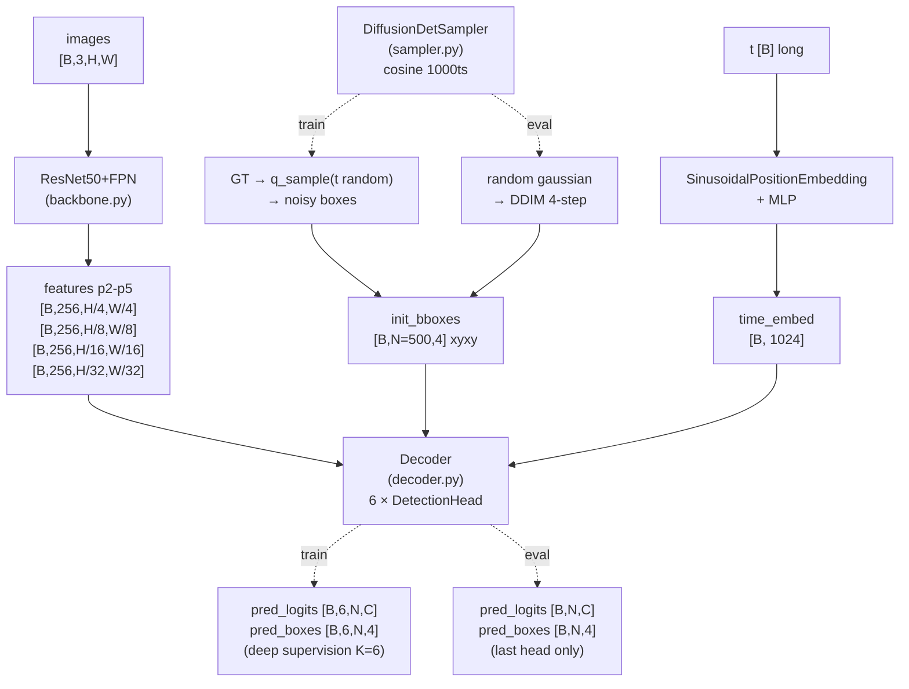
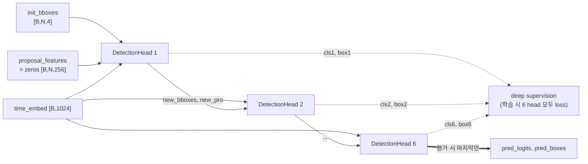
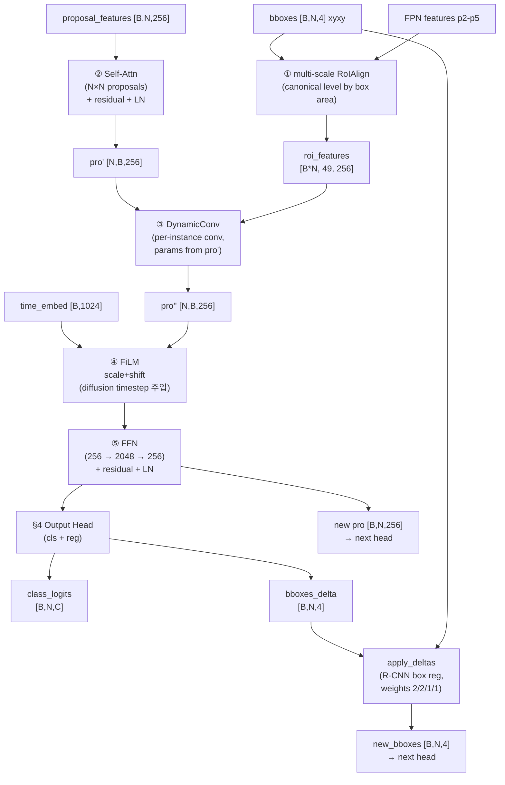
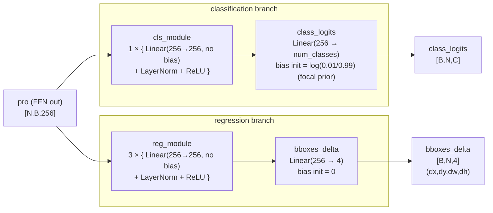
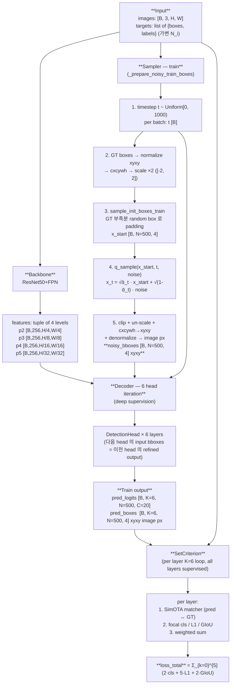
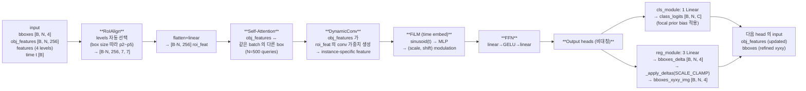
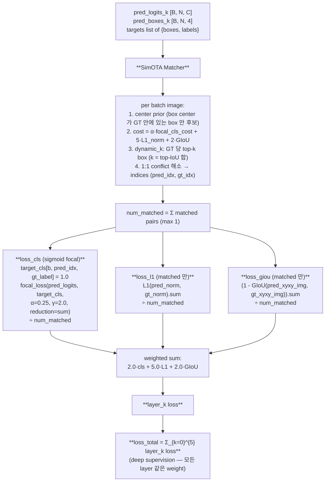
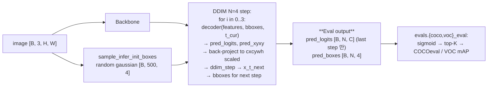

# models/ — DiffusionDet 재구현

`detectron2` 없이 PyTorch + torchvision 만으로 DiffusionDet 동치 구현. 110.7M 파라미터.

> **"Detection head" 의 두 의미** (혼동 방지)
> - **넓은 의미 (refinement head)**: `DetectionHead` 클래스 — 6번 반복되어 box/class 를 한 단계씩 정제하는 단위 (decoder.py).
> - **좁은 의미 (output head)**: `DetectionHead` 의 *끝부분* — `cls_module → class_logits` (classification) + `reg_module → bboxes_delta` (regression). 실제 cls/box 예측을 뱉는 모듈.
>
> 아래 §3 (refinement head) 와 §4 (output head) 가 각각에 대응.

---

## 1. 전체 구조



---

## 2. Decoder — 6 head 반복 (iterative refinement)



- 학습: 6 head 출력을 모두 쌓아 deep supervision (Hungarian 매칭 → set loss × 6).
- 평가: 마지막 head 출력만 사용, DDIM 외부 루프(4 step)가 boxes 를 점진적으로 업데이트.

---

## 3. DetectionHead (refinement 단위) — 1번의 iteration

한 head 의 내부 5 단계 — input boxes 를 self-attn / instance-conv / time-modulation / FFN 으로 정제한 뒤, **§4 출력 head** 가 cls + box delta 를 뽑는다.



| stage | 모듈 | 텐서 변화 | 비고 |
|------|------|---------|------|
| ① RoIAlign | `_multi_scale_roi_align` | `[B,N,4]` + features → `[B*N, 49, 256]` | FPN paper canonical level `k = clip(floor(4+log2(√area/224)), 2, 5)` |
| ② Self-Attn | `nn.MultiheadAttention(d=256, h=8)` | `[N,B,256] → [N,B,256]` | residual + dropout + LayerNorm |
| ③ DynamicConv | `DynamicConv` | `(pro, roi) → [B*N,256]` | pro 가 두 dynamic linear param 생성 (64+64 channel), roi 에 bmm 적용 |
| ④ FiLM (time) | `block_time_mlp` | `[B,1024] → [B,2·256]` | `pro = pro·(scale+1) + shift`, diffusion timestep 주입 |
| ⑤ FFN | `linear1 → ReLU → linear2` | `[N,B,256] → [N,B,256]` | residual + dropout + LayerNorm |

---

## 4. Output Head (좁은 의미의 detection head) — cls + reg

§3 의 정제된 `pro` (FFN 출력, `[N,B,256]`) 를 받아 **class score** 와 **box delta** 를 뽑는 부분. 두 branch 가 분리되어 있고 각각 자체 MLP (`cls_module` 1층, `reg_module` 3층) 를 가진다.



### 4.1. 정확한 구조 (코드 매핑)

`models/decoder.py:135-156` 의 `DetectionHead.__init__` 끝부분이 출력 head:

```python
# cls head
cls_module = []
for _ in range(num_cls_layers):          # default 1
    cls_module += [nn.Linear(d_model, d_model, bias=False),
                   nn.LayerNorm(d_model), nn.ReLU(inplace=True)]
self.cls_module = nn.ModuleList(cls_module)

# reg head
reg_module = []
for _ in range(num_reg_layers):          # default 3
    reg_module += [nn.Linear(d_model, d_model, bias=False),
                   nn.LayerNorm(d_model), nn.ReLU(inplace=True)]
self.reg_module = nn.ModuleList(reg_module)

self.class_logits = nn.Linear(d_model, num_classes)   # 최종 cls projection
self.bboxes_delta = nn.Linear(d_model, 4)             # 최종 reg projection

# focal loss bias prior (cls 만)
prior_prob = 0.01
bias_value = -math.log((1 - prior_prob) / prior_prob)  # ≈ -4.595
nn.init.constant_(self.class_logits.bias, bias_value)
nn.init.constant_(self.bboxes_delta.bias, 0.0)
```

### 4.2. 두 branch 가 비대칭인 이유

| 항목 | cls branch | reg branch |
|------|----------|----------|
| MLP 깊이 | 1 layer | **3 layer** |
| 최종 projection | `256 → num_classes` | `256 → 4` |
| bias init | focal prior `log(0.01/0.99)` | 0 |
| 출력 의미 | per-class score (sigmoid 후 focal loss) | (dx,dy,dw,dh) delta → `_apply_deltas` |
| loss 활용 | `losses/criterion.py` focal loss | L1 + GIoU |

**왜 reg 가 3 layer 인가**: DiffusionDet/Sparse R-CNN 가 box 정제를 위해 reg branch 를 깊게 둠 (cls 는 ImageNet pretrained backbone 으로 이미 충분). 본 repo (`num_reg_layers=3, num_cls_layers=1`) 도 그대로 따름.

### 4.3. 출력 후 처리

```
bboxes_delta [B,N,4]   ┐
                       ├──► _apply_deltas (R-CNN reg, weights 2/2/1/1) ──► new_bboxes [B,N,4]
input bboxes [B,N,4]   ┘                                                        │
                                                                                │
class_logits [B,N,C]  ─────────────────────────────────────────► 그대로 loss/eval
                                                                                ▼
                                                                       다음 head 입력
                                                                       (또는 최종 출력)
```

- `_apply_deltas` 는 standard R-CNN box regression: ctr/wh 에 (dx,dy,dw,dh) 적용, `weights=(2,2,1,1)` 로 정규화, `dw/dh` 는 `log(100000/16) ≈ 8.74` 로 clamp (폭주 방지).
- cls logit 은 그대로 다음 head 로 전달하지 않음 (per-head 독립 prediction). box 만 누적적으로 refine.

---

## 5. 컴포넌트 표

| 모듈 | 파일 | 입력 shape | 출력 shape | 비고 |
|------|------|----------|----------|------|
| ResNet50FPN | `backbone.py` | `[B,3,H,W]` | `list[Tensor[B,256,Hi,Wi]] × 4` | torchvision `resnet_fpn_backbone`, FrozenBN, freeze_at=2 |
| DiffusionDetSampler | `sampler.py` | (forward) `[B,N,4]` cxcywh scaled + `t [B]` | `[B,N,4]` noisy | cosine schedule 1000ts, DDIM eta=0, num_inference_steps=4 |
| DetectionHead (refinement) | `decoder.py` | features, `[B,N,4]`, `[B,N,256]`, `[B,1024]` | new boxes `[B,N,4]`, logits `[B,N,C]`, new pro `[B,N,256]` | §3 — RoIAlign + Self-Attn + DynamicConv + FiLM + FFN |
| └─ cls/reg output head | `decoder.py` (DetectionHead 끝) | pro `[N,B,256]` | cls `[B,N,C]`, delta `[B,N,4]` | §4 — cls 1-layer + 256→C, reg 3-layer + 256→4, focal prior bias |
| Decoder | `decoder.py` | features, `[B,N,4]`, `t [B]` | logits `[B,K,N,C]`, boxes `[B,K,N,4]` (K=6 train / 1 eval) | 6 head deep supervision (train), last only (eval) |
| DiffusionDet | `diffusiondet.py` | `[B,3,H,W]` + targets (train) | dict {pred_logits, pred_boxes, image_sizes} | 통합 nn.Module |

---

## 6. 의존
- `torch`, `torchvision.ops.roi_align`, `torchvision.models.detection.backbone_utils.resnet_fpn_backbone`
- detectron2 **없음** (CLAUDE.md CRITICAL)

## 7. 사전학습 가중치 (자동 다운로드)

torchvision 이 `ResNet50FPN` 빌드 시 ImageNet 사전학습 ResNet50 가중치를 자동 다운:

| 파일 | 컨테이너 안 위치 | 크기 | 비고 |
|------|----------------|------|------|
| `resnet50-11ad3fa6.pth` | `/home/docker_user/.cache/torch/hub/checkpoints/` | 97.8 MB | torchvision DEFAULT weights (IMAGENET1K_V2) |

이 디렉터리는 `env_docker/docker-compose.yml` 의 named volume `torch-cache` 로 마운트 — **컨테이너 재시작/재빌드 시에도 보존** (rebuild 후에도 재다운 불필요).

수동 캐시 위치 확인:
```bash
ls -lh ~/.cache/torch/hub/checkpoints/   # 컨테이너 안
docker volume inspect fm-det_torch-cache  # 호스트
```

오프라인 환경에서는 호스트 → 컨테이너로 미리 복사:
```bash
docker cp resnet50-11ad3fa6.pth <container>:/home/docker_user/.cache/torch/hub/checkpoints/
```

## 8. 학습/평가 모드 차이
- 학습: `model.train()` + `targets` 필수 → noisy GT 박스 입력 + 6-head deep supervision 출력 `[B,6,N,·]`.
- 평가: `model.eval()` + targets=None → random gaussian 초기 박스 + DDIM 4-step → 마지막 head 출력 `[B,N,·]`.

## 9. 파라미터 수
- 110.7M total (DiffusionDet 본 repo 동치, ~110M 기대치 내)
- 분포: backbone ResNet50 ≈ 25M, FPN ≈ 3M, decoder 6 heads ≈ 82M
  - 한 head 내부에서 비중 큰 부분: DynamicConv (`dynamic_layer`: 256→2·16384 ≈ 8.4M), FFN (`linear1` 256→2048 + `linear2` 2048→256 ≈ 1M), reg_module 3-layer (3×256² ≈ 0.2M), `class_logits` (256·80=20K).

---

## 10. 학습 흐름 전체 (입력 → loss)

> 한 forward+backward step 을 *데이터 입력부터 loss 까지* 단계별로 추적. shape 은 VOC `batch=32`, image 800×800 기준.

### 10.1. Train 모드 전체



### 10.2. 한 DetectionHead 내부 — 5 stage refinement



### 10.3. Loss 계산 (per-layer × K=6)



### 10.4. 단계별 shape 흐름 표 (VOC batch=32, image 800×800)

| stage | tensor | shape | 의미 |
|---|---|---|---|
| 0 | input image | `[32, 3, 800, 800]` | collate 후 32 배수 zero-pad |
| 0 | targets | list of 32 dicts | per-image GT 가변 N_i |
| 1 | backbone.p2 | `[32, 256, 200, 200]` | stride 4 |
| 1 | backbone.p3 | `[32, 256, 100, 100]` | stride 8 |
| 1 | backbone.p4 | `[32, 256, 50, 50]` | stride 16 |
| 1 | backbone.p5 | `[32, 256, 25, 25]` | stride 32 |
| 2 | sampler t | `[32]` | random timestep ∈ [0, 1000) |
| 2 | x_start (cxcywh scaled) | `[32, 500, 4]` | GT + random padding, range [-2, 2] |
| 2 | x_t (q_sample) | `[32, 500, 4]` | noised box, range [-2, 2] |
| 2 | noisy_bboxes xyxy img | `[32, 500, 4]` | image px, decoder input |
| 3 | RoIAlign (per head) | `[32·500, 256, 7, 7]` | 16k boxes 의 ROI feature |
| 3 | obj_features | `[32, 500, 256]` | head 별 갱신 |
| 3 | DetectionHead × 6 cls | `[32, 500, 20]` per layer | VOC num_classes=20 |
| 3 | DetectionHead × 6 box | `[32, 500, 4]` per layer | refined xyxy img |
| 4 | pred_logits (stacked) | `[32, 6, 500, 20]` | deep supervision 용 |
| 4 | pred_boxes (stacked) | `[32, 6, 500, 4]` | deep supervision 용 |
| 5 | SimOTA indices | list of 6 layers × 32 batches | (pred_idx, gt_idx) tuples |
| 5 | loss_cls / l1 / giou | scalar (per layer) | × 6 layers 누적 |
| 5 | **loss_total** | scalar | weighted sum, backward 시작점 |

### 10.5. Eval 모드 (참고 — train 과 다름)


