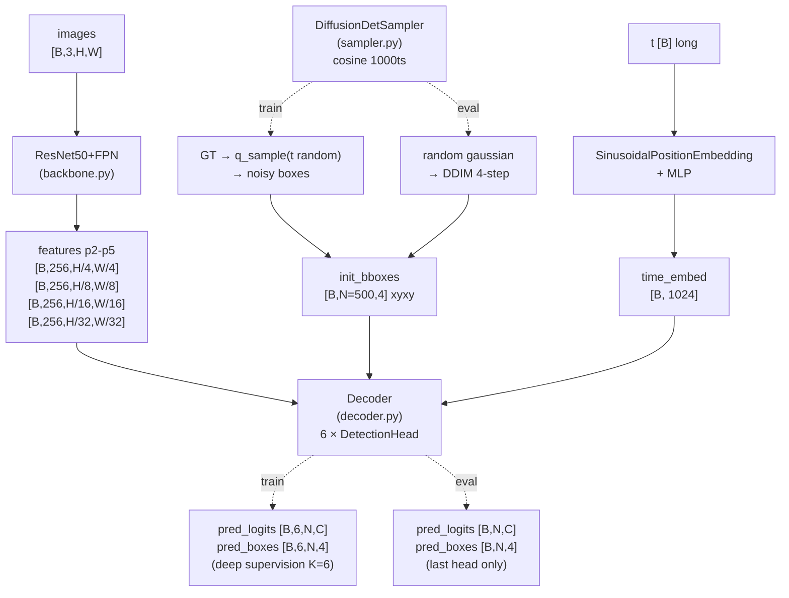
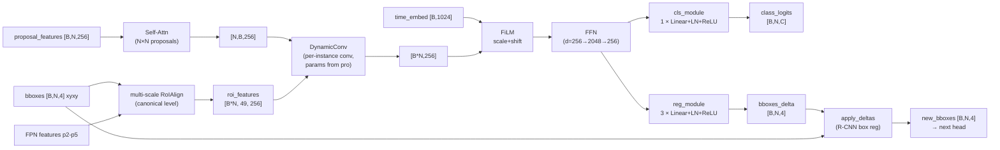

# models/ — DiffusionDet 재구현

`detectron2` 없이 PyTorch + torchvision 만으로 DiffusionDet 동치 구현. 110.7M 파라미터.

## 전체 구조



## DetectionHead 내부



## 컴포넌트 표

| 모듈 | 파일 | 입력 shape | 출력 shape | 비고 |
|------|------|----------|----------|------|
| ResNet50FPN | `backbone.py` | `[B,3,H,W]` | `list[Tensor[B,256,Hi,Wi]] × 4` | torchvision `resnet_fpn_backbone`, FrozenBN, freeze_at=2 |
| DiffusionDetSampler | `sampler.py` | (forward) `[B,N,4]` cxcywh scaled + `t [B]` | `[B,N,4]` noisy | cosine schedule 1000ts, DDIM eta=0, num_inference_steps=4 |
| DetectionHead | `decoder.py` | features, `[B,N,4]`, `[B,N,256]`, `[B,1024]` | new boxes `[B,N,4]`, logits `[B,N,C]`, new pro `[B,N,256]` | RoIAlign + Self-Attn + DynamicConv + FFN + FiLM(time) + cls/reg heads |
| Decoder | `decoder.py` | features, `[B,N,4]`, `t [B]` | logits `[B,K,N,C]`, boxes `[B,K,N,4]` (K=6 train / 1 eval) | 6 head deep supervision (train), last only (eval) |
| DiffusionDet | `diffusiondet.py` | `[B,3,H,W]` + targets (train) | dict {pred_logits, pred_boxes, image_sizes} | 통합 nn.Module |

## 의존
- `torch`, `torchvision.ops.roi_align`, `torchvision.models.detection.backbone_utils.resnet_fpn_backbone`
- detectron2 **없음** (CLAUDE.md CRITICAL)

## 사전학습 가중치 (자동 다운로드)

torchvision 이 `ResNet50FPN` 빌드 시 ImageNet 사전학습 ResNet50 가중치를 자동 다운:

| 파일 | 컨테이너 안 위치 | 크기 | 비고 |
|------|----------------|------|------|
| `resnet50-11ad3fa6.pth` | `/home/docker_user/.cache/torch/hub/checkpoints/` | 97.8 MB | torchvision DEFAULT weights (IMAGENET1K_V2) |

이 디렉터리는 `env_docker/docker-compose.yml` 의 named volume `torch-cache` 로 마운트 — **컨테이너 재시작/재빌드 시에도 보존** (rebuild 후에도 재다운 불필요).

수동 캐시 위치 확인:
```bash
ls -lh ~/.cache/torch/hub/checkpoints/   # 컨테이너 안
docker volume inspect fm-det_torch-cache  # 호스트
```

오프라인 환경에서는 호스트 → 컨테이너로 미리 복사:
```bash
docker cp resnet50-11ad3fa6.pth <container>:/home/docker_user/.cache/torch/hub/checkpoints/
```

## 학습/평가 모드 차이
- 학습: `model.train()` + `targets` 필수 → noisy GT 박스 입력 + 6-head deep supervision 출력
- 평가: `model.eval()` + targets=None → random gaussian 초기 박스 + DDIM 4-step → 마지막 head 출력

## 파라미터 수
- 110.7M total (DiffusionDet 본 repo 동치, ~110M 기대치 내)
- 분포: backbone ResNet50 ≈ 25M, FPN ≈ 3M, decoder 6 heads ≈ 82M
