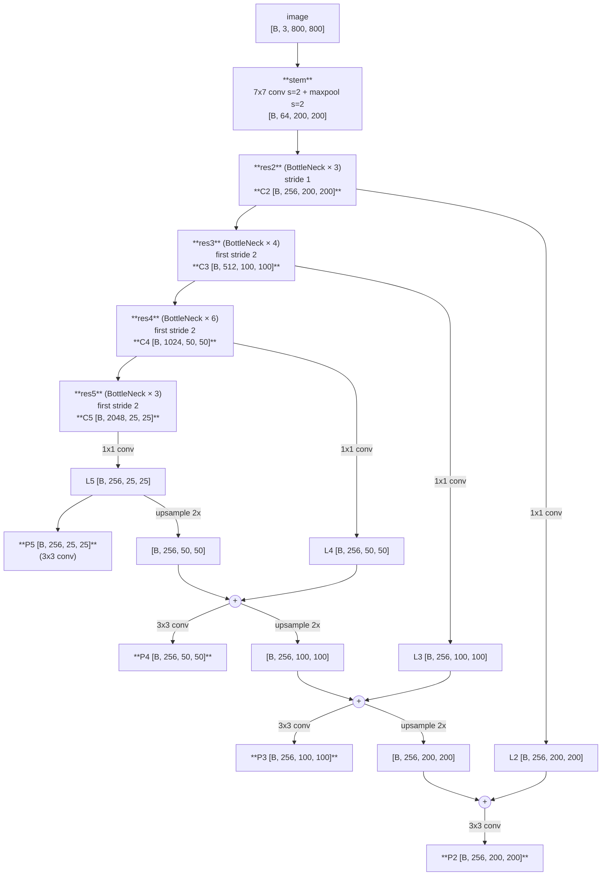
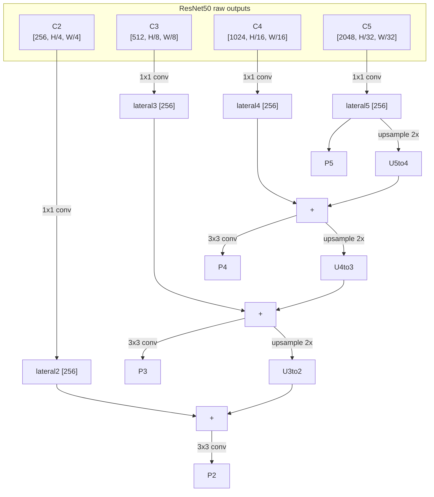
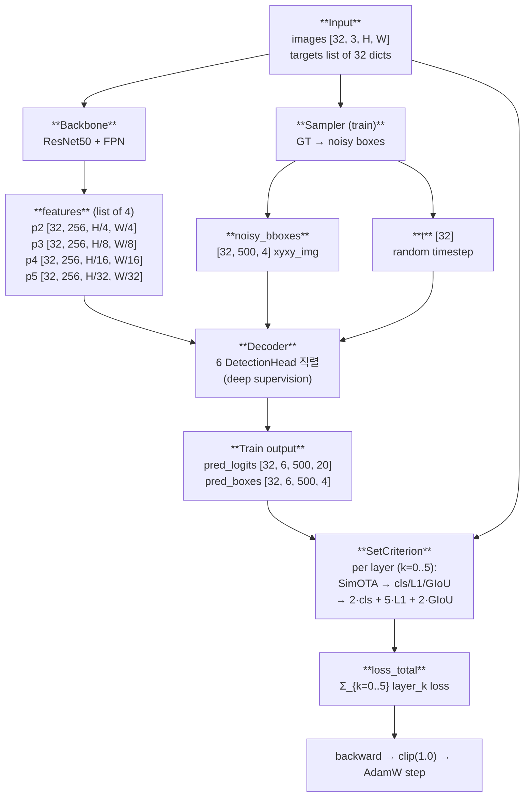
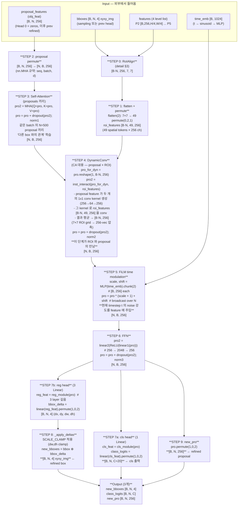
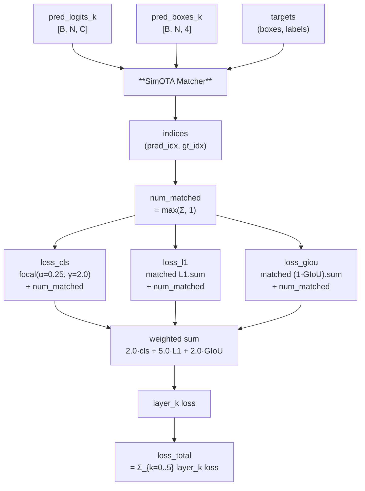

# models/ 학습 노트

> 코드 공부하면서 헷갈리거나 막힌 부분을 누적 정리. README.md 의 보조 자료.

---

## 1. 이미지 → ResNet50 → FPN — stage-by-stage shape

### 1.0. 전체 한 줄 흐름

```
image [B, 3, 800, 800]
   │
   ▼ stem (7x7 conv s=2, BN, ReLU, 3x3 maxpool s=2)        ← /4 (총)
   ▼ [B, 64, 200, 200]
   │
   ▼ res2 (3 BottleNeck blocks)                            ← /4 유지
   ▼ C2 [B, 256, 200, 200]   ← FPN 입력 1
   │
   ▼ res3 (4 BottleNeck blocks, first block stride 2)      ← /8
   ▼ C3 [B, 512, 100, 100]   ← FPN 입력 2
   │
   ▼ res4 (6 BottleNeck blocks, first block stride 2)      ← /16
   ▼ C4 [B, 1024, 50, 50]    ← FPN 입력 3
   │
   ▼ res5 (3 BottleNeck blocks, first block stride 2)      ← /32
   ▼ C5 [B, 2048, 25, 25]    ← FPN 입력 4
   │
   │ (raw ResNet 끝, FPN 시작)
   │
   ▼ FPN (1x1 lateral + top-down upsample + 3x3 smoothing)
   ▼
   P2 [B, 256, 200, 200]     ← detection head 출력 1 (작은 object 용)
   P3 [B, 256, 100, 100]     ← detection head 출력 2
   P4 [B, 256,  50,  50]     ← detection head 출력 3
   P5 [B, 256,  25,  25]     ← detection head 출력 4 (큰 object 용)
```

### 1.0.1. 각 단계 자세히

| 단계 | 입력 | 연산 | 출력 |
|------|------|------|------|
| **stem** | `[B, 3, 800, 800]` | Conv2d(3→64, 7x7, stride=2, padding=3) + BN + ReLU + MaxPool(3, stride=2) | `[B, 64, 200, 200]` |
| **res2** (BottleNeck × 3) | `[B, 64, 200, 200]` | stride 1 (해상도 유지), 채널 64→256 | **C2** `[B, 256, 200, 200]` |
| **res3** (BottleNeck × 4) | C2 | 첫 block stride 2 (해상도 절반), 256→512 | **C3** `[B, 512, 100, 100]` |
| **res4** (BottleNeck × 6) | C3 | 첫 block stride 2, 512→1024 | **C4** `[B, 1024, 50, 50]` |
| **res5** (BottleNeck × 3) | C4 | 첫 block stride 2, 1024→2048 | **C5** `[B, 2048, 25, 25]` |
| **FPN lateral 1x1** (4 개) | C2/C3/C4/C5 | 각 1x1 Conv → 256 채널 통일 | L2/L3/L4/L5 `[B, 256, ...]` (해상도 동일) |
| **FPN top-down + 3x3** | L5 → L4 → L3 → L2 | 위에서 아래로 upsample 2x + add + 3x3 smoothing | **P2/P3/P4/P5** `[B, 256, ...]` |

### 1.0.2. mermaid — 한 그림으로



### 1.0.3. 핵심 변환 요약

| 위치 | 채널 변화 | 해상도 변화 |
|------|----------|-------------|
| stem | 3 → 64 | /4 (7x7 s=2 + maxpool s=2) |
| res2 (C2) | 64 → **256** | /4 유지 |
| res3 (C3) | 256 → **512** | /8 (×2 다운) |
| res4 (C4) | 512 → **1024** | /16 (×2 다운) |
| res5 (C5) | 1024 → **2048** | /32 (×2 다운) |
| FPN lateral 1x1 | 256/512/1024/2048 → **256** (통일) | 해상도 유지 |
| FPN top-down upsample | 256 유지 | ×2 (P5→P4→P3→P2 방향) |
| FPN 3x3 smoothing | 256 유지 | 해상도 유지 |

**최종 출력**: `list[Tensor]` of 4 → P2 / P3 / P4 / P5, **모두 256 채널**, 해상도만 다름 (입력의 /4, /8, /16, /32).

---

## 1. FPN 내부 흐름 (top-down + lateral)

### 1.1. 큰 그림



### 1.2. ASCII 로 더 명확히

```
ResNet stages (bottom-up)         FPN (top-down + lateral)
─────────────────────────         ──────────────────────────────

C2 [256, H/4, W/4]   ───[1x1]──→  L2  ──┐
                                         + ◄── F.interpolate(prev, mode='nearest', size=L2.shape)  ──[3x3]──→  P2 [256, H/4, W/4]
                                         │                                                            ↑ anti-aliasing
C3 [512, H/8, W/8]   ───[1x1]──→  L3  ──┤
                                         + ◄── F.interpolate(prev, mode='nearest', size=L3.shape)  ──[3x3]──→  P3 [256, H/8, W/8]
                                         │
C4 [1024, H/16, W/16]───[1x1]──→  L4  ──┤
                                         + ◄── F.interpolate(prev, mode='nearest', size=L4.shape)  ──[3x3]──→  P4 [256, H/16, W/16]
                                         │
C5 [2048, H/32, W/32]───[1x1]──→  L5  ─→ ↓
                                          └────────────────────[3x3]──────────────────────────────→  P5 [256, H/32, W/32]
                                          (top-down 의 출발점, upsample 받는 input 없음)


방향:
- bottom-up: ResNet 의 자연스러운 forward (C2 → C3 → C4 → C5).
- top-down: P5 에서 시작해 P4, P3, P2 순으로 거꾸로 내려옴.
- lateral: 같은 stride 의 C_i 를 1x1 conv 로 채널 256 맞춰 더함.
- upsample: **F.interpolate(mode='nearest')** — pixel copy, 파라미터 0. **ConvTranspose2d 아님**. 자세히 §1.6.
```

### 1.3. 단계별 변환표

| 단계 | 입력 | 연산 | 출력 |
|------|------|------|------|
| 1. C2 raw | `[B, 256, H/4, W/4]` | — | C2 |
| 1. C3 raw | `[B, 512, H/8, W/8]` | — | C3 |
| 1. C4 raw | `[B, 1024, H/16, W/16]` | — | C4 |
| 1. C5 raw | `[B, 2048, H/32, W/32]` | — | C5 |
| 2. lateral 1x1 conv | C_i (가변 채널) | 1x1 Conv2d(C_i.channels → 256) | L_i [B, 256, H/2^i, W/2^i] |
| 3. top-down upsample | L5 또는 ADD_{i+1} | `F.interpolate(scale_factor=2, mode='nearest')` | U_i [B, 256, H/2^{i-1}, W/2^{i-1}] |
| 4. element-wise add | L_i + U_{i+1} (같은 shape) | tensor + | ADD_i |
| 5. anti-aliasing | ADD_i | 3x3 Conv2d(256 → 256, padding=1) | **P_i** [B, 256, H/2^i, W/2^i] |

특수 케이스:
- **P5 는 upsample 안 받음** — top-down 의 시작점. `P5 = 3x3conv(L5)` 만.

### 1.4. 왜 이 디자인?

| 문제 | FPN 의 해결 |
|------|-------------|
| C2 는 high-res 이지만 의미 약함 (texture 수준) | top-down 으로 C5 의 강한 semantic 을 upsample 해서 C2 에 주입 → P2 는 high-res + semantic |
| C5 는 의미 강하지만 위치 모호 (25x25) | P5 는 변화 없음 (top-down 의 출발점). 그대로 low-res, 큰 object 검출용 |
| 각 level 채널 수 다름 (256/512/1024/2048) → 다음 모듈이 level 별로 다르게 처리해야 함 | 1x1 lateral conv 가 모두 256 으로 통일 → 다음 모듈 (RoIAlign + head) 는 어떤 level 이든 같은 채널 |
| nearest upsample 이 만든 blocky artifact | element-wise add 후 3x3 conv 로 smoothing |

### 1.5. 코드 위치

우리 코드는 **torchvision 의 `resnet_fpn_backbone` 을 wrap**. 내부에 FPN 구현 다 들어 있음:

```python
# models/backbone.py:30
self.body = resnet_fpn_backbone(
    backbone_name="resnet50",
    weights="DEFAULT",
    trainable_layers=3,        # res3,4,5 학습 (res2 + stem freeze)
    returned_layers=[1,2,3,4], # res2 → res5 의 output (= C2~C5)
    extra_blocks=None,         # P6 사용 안 함 (DiffusionDet 동치)
    norm_layer=FrozenBatchNorm2d,
)
```

torchvision 의 `_default_anchorgen` 내부에서 `FeaturePyramidNetwork(in_channels_list=[256,512,1024,2048], out_channels=256, ...)` 가 위 1.2 의 흐름을 정확히 수행.

### 1.6. Top-down upsample — "아래 feature 를 위로 올리는" 메커니즘

**한 줄 의미**: low-res (의미 강함, 위치 모호) 를 high-res 자리로 옮겨서 — high-res 영역에 의미를 주입.

#### 1.6.1. upsample mode: `nearest`

torchvision FPN 의 default + DiffusionDet 본 repo 동치:

```python
# torchvision/ops/feature_pyramid_network.py
inner_top_down = F.interpolate(last_inner, size=feat_shape, mode="nearest")
```

`scale_factor` 가 아닌 `size=feat_shape` 명시 — 입력 H,W 가 정확한 2 배수 아닐 수도 있으니 lateral 의 shape 에 정확히 맞춤.

#### 1.6.2. Nearest neighbor 가 뭔지

```
원본 (low-res) [3, 3]:                Upsample 2x [6, 6] (nearest):
                                          a a b b c c
   a b c                                  a a b b c c
   d e f       ─────[nearest 2x]─→        d d e e f f
   g h i                                  d d e e f f
                                          g g h h i i
                                          g g h h i i

같은 pixel 을 2x2 로 copy. 보간 없음. 파라미터 0.
```

#### 1.6.3. 왜 nearest? (bilinear / deconv 도 가능하지만 안 씀)

| 방식 | 장단점 | FPN 채택 |
|---|---|---|
| **nearest** | 파라미터 0, 빠름, blocky → 다음 3x3 conv 가 흡수 | ✅ |
| bilinear | 부드러움, 파라미터 0, 약간 느림 | X (이론적으로 가능) |
| ConvTranspose2d ("학습 가능 upsample") | 파라미터 ↑, checkerboard artifact 위험 | X (FPN 디자인 의도와 안 맞음) |

FPN paper (Lin et al. 2017) 의 의도:
> "We use nearest neighbor upsampling for simplicity."

뒤에 오는 **3×3 anti-aliasing conv** 가 nearest 의 blocky artifact 를 흡수. 이 conv 가 학습되면서 "어디가 진짜 edge 인가" 를 학습.

#### 1.6.4. 한 level 의 처리 ASCII

```
[P5 lateral] L5 [256, 25, 25]
       │
       ▼ ① nearest upsample 2x  (같은 값 2x2 복제)
       │
[L5↑]    [256, 50, 50]   ← P4 영역으로 "올라옴". blocky.
       +
[P4 lateral] L4 [256, 50, 50]   ← 원래 자리의 detail / 위치 정보
       │
       ▼ ② element-wise add  (의미 + 위치)
       │
[ADD4]   [256, 50, 50]
       │
       ▼ ③ 3x3 conv  (blocky 흡수, edge 정련)
       │
[P4]     [256, 50, 50]   ← 완성. 의미 (from L5) + 위치 (from L4) 모두.
```

이를 P4→P3, P3→P2 도 똑같이 반복. 4 level 모두 채널 256 통일 + 의미 + 위치 가짐.

#### 1.6.5. 시각화 — "아래 → 위" 의미 흐름

```
ResNet 깊이 방향 (semantic 점점 강함)
─────────────────────────────────────────
                            P5 [256, 25, 25]     ← C5 의 강한 의미 그대로
                                 │
                                 ↓ upsample + add L4 + 3x3 conv
                            P4 [256, 50, 50]     ← P5 의 의미 ↓ + L4 의 위치
                                 │
                                 ↓ upsample + add L3 + 3x3 conv
                            P3 [256, 100, 100]   ← P4 의 의미 ↓ + L3 의 위치
                                 │
                                 ↓ upsample + add L2 + 3x3 conv
                            P2 [256, 200, 200]   ← P3 의 의미 ↓ + L2 의 위치
                                                  (high-res + semantic)
```

이게 "아래 (low-res, 의미 강함) 를 위 (high-res 자리) 로 올리는" 메커니즘. 마지막엔 P2 도 의미를 가지게 됨.

---

### 1.7. DiffusionDet 에서 FPN 의 다음 단계

4 개 P feature 가 list 로 backbone forward 출력 → decoder 의 매 DetectionHead 가 같은 4 features 를 reference 로 RoIAlign 호출:

```python
# decoder.py:167
k = k.clamp(min=2, max=5).long() - 2  # box sqrt(area) 기준 → p2..p5 index 0..3
roi_feat = roi_align(features[k], boxes_in_this_level, output_size=7)
```

box 크기에 따라 자동으로 적합한 level 선택:
- 작은 box (sqrt(area) ~56 px) → P2 (stride 4, [200×200] @ 800 입력)
- 큰 box (sqrt(area) ~448 px) → P5 (stride 32, [25×25] @ 800 입력)

→ 즉 FPN 의 4 level 이 모두 활용됨 (사용 안 되는 level 없음).

---

## 2. 전체 학습 흐름 (input → loss) — ASCII + mermaid

> 한 forward + backward step 의 *데이터 입력부터 loss 까지* 모든 단계.
> 기준: VOC `batch=32`, image 800×800 (실제는 collate 후 가변 H,W).

### 2.1. ASCII 다이어그램

```
INPUT
  images:  [B=32, 3, H=800, W=800]   (collate 후 32 배수 padding, padding_mask)
  targets: list[32] of dicts
    └─ each {boxes [N_i, 4] xyxy in image px, labels [N_i], image_id, orig_size, size}
        │
        │
  ┌─────┴────────────────────────────────────────────────────────────────┐
  │                                                                      │
  ▼                                                                      ▼
┌────────────────────────────────┐     ┌────────────────────────────────────────┐
│  Backbone (ResNet50 + FPN)     │     │  Sampler (train mode)                  │
│  forward 1회                   │     │  _prepare_noisy_train_boxes            │
└──────────────┬─────────────────┘     │                                        │
               │                       │  1. t ~ Uniform[0, 1000) per batch     │
               ▼                       │     t [32]                             │
  ┌────────────────────────────┐       │                                        │
  │  features (list, 4 level)  │       │  2. GT xyxy → normalize → cxcywh       │
  │  ─ p2 [32, 256, 200, 200]  │       │     → scale ×2  ([-signal_scale, +])  │
  │  ─ p3 [32, 256, 100, 100]  │       │                                        │
  │  ─ p4 [32, 256,  50,  50]  │       │  3. sample_init_boxes_train            │
  │  ─ p5 [32, 256,  25,  25]  │       │     GT 부족분 random box padding       │
  └─────────────┬──────────────┘       │     x_start [32, 500, 4]               │
                │                      │                                        │
                │                      │  4. q_sample(x_start, t, noise)        │
                │                      │     x_t = √ᾱ_t·x_start + √(1-ᾱ_t)·noise│
                │                      │                                        │
                │                      │  5. clip + un-scale + cxcywh→xyxy      │
                │                      │     + denormalize                      │
                │                      │     ───────────────────────────────    │
                │                      │     noisy_bboxes [32, 500, 4] xyxy_img │
                │                      └──────────────┬─────────────────────────┘
                │                                     │
                │             ┌───────────────────────┘
                │             │
                ▼             ▼                        ▼ (time t)
  ┌────────────────────────────────────────────────────────────────────────┐
  │  Decoder — DetectionHead × 6 직렬 (deep supervision)                   │
  │  features 1회 계산 → 6 번 재사용. bboxes 와 obj_feat 만 갱신.          │
  │                                                                        │
  │  ┌─ Head 0 ─────────────────────────────────────────┐                  │
  │  │ input:  bboxes_0 (= noisy_bboxes)                │                  │
  │  │         obj_feat_0 (= zeros 초기)                │                  │
  │  │ ┌──────────────────────────────────────────┐     │                  │
  │  │ │ stage 1: RoIAlign(features, bboxes)      │     │                  │
  │  │ │   box sqrt(area) → level (p2~p5) 선택    │     │                  │
  │  │ │   → roi_feat [32·500, 256, 7, 7]         │     │                  │
  │  │ │ stage 2: flatten + linear                │     │                  │
  │  │ │   → roi_flat [32·500, 256]               │     │                  │
  │  │ │ stage 3: Self-Attention                  │     │                  │
  │  │ │   obj_feat ↔ same-batch boxes            │     │                  │
  │  │ │ stage 4: DynamicConv                     │     │                  │
  │  │ │   obj_feat 가 roi_feat 의 conv 가중치    │     │                  │
  │  │ │   생성 → instance-specific feature       │     │                  │
  │  │ │ stage 5: FiLM (time t embed)             │     │                  │
  │  │ │   sin(t) → MLP → (scale, shift)          │     │                  │
  │  │ │ stage 6: FFN (linear→GELU→linear)        │     │                  │
  │  │ │ output:                                  │     │                  │
  │  │ │   cls_module (1 Linear) → cls_logits_0   │     │                  │
  │  │ │     [32, 500, C=20]                      │     │                  │
  │  │ │   reg_module (3 Linear) → bbox_delta_0   │     │                  │
  │  │ │     → _apply_deltas(SCALE_CLAMP)         │     │                  │
  │  │ │     → bboxes_1 [32, 500, 4] xyxy_img     │     │                  │
  │  │ └──────────────────────────────────────────┘     │                  │
  │  │ output: bboxes_1, obj_feat_1                     │                  │
  │  └─────────────────────────┬────────────────────────┘                  │
  │                            ▼                                           │
  │  ┌─ Head 1 ─────────────────────────────────────────┐                  │
  │  │ input:  bboxes_1, obj_feat_1                     │                  │
  │  │ ... 동일 stages ...                              │                  │
  │  │ output: bboxes_2, obj_feat_2 + cls_logits_1      │                  │
  │  └─────────────────────────┬────────────────────────┘                  │
  │                            ▼                                           │
  │            ... Head 2, 3, 4 ...                                        │
  │                            ▼                                           │
  │  ┌─ Head 5 ─────────────────────────────────────────┐                  │
  │  │ output: cls_logits_5, bboxes_6                   │                  │
  │  └─────────────────────────┬────────────────────────┘                  │
  │                            ▼                                           │
  │  per-layer outputs stack:                                              │
  │    pred_logits [32, 6, 500, 20]                                        │
  │    pred_boxes  [32, 6, 500, 4]  xyxy_img                               │
  └─────────────────────────────┬──────────────────────────────────────────┘
                                │
                                ▼
  ┌────────────────────────────────────────────────────────────────────────┐
  │  Criterion (SetCriterion) — deep supervision (모든 6 layer)            │
  │                                                                        │
  │  for k in 0..5:                                                        │
  │    pred_logits_k [32, 500, 20], pred_boxes_k [32, 500, 4]              │
  │                                                                        │
  │    1. SimOTA matcher (per batch image)                                 │
  │       a. center prior: box center 가 GT 안 → 후보                      │
  │       b. cost = α·focal_cls + 5·L1_norm + 2·GIoU                       │
  │       c. dynamic_k: GT 당 top-k box (k = top-IoU 합)                   │
  │       d. 1:1 conflict 해소                                             │
  │       → indices: list of (pred_idx, gt_idx) per batch                  │
  │                                                                        │
  │    2. num_matched = Σ matched (max 1)                                  │
  │                                                                        │
  │    3. loss_cls (sigmoid focal):                                        │
  │         target_cls[b, pred_idx, gt_label] = 1.0                        │
  │         focal_loss(α=0.25, γ=2.0, reduction=sum) / num_matched         │
  │                                                                        │
  │    4. loss_l1 (matched 만):                                            │
  │         L1(pred_norm, gt_norm).sum / num_matched                       │
  │                                                                        │
  │    5. loss_giou (matched 만):                                          │
  │         (1 - GIoU(pred_xyxy_img, gt_xyxy_img)).sum / num_matched       │
  │                                                                        │
  │    layer_k loss = 2.0·cls + 5.0·L1 + 2.0·GIoU                          │
  │                                                                        │
  │  ─────────────────────────────────                                     │
  │  loss_total = Σ_{k=0}^{5} layer_k loss                                 │
  └─────────────────────────────┬──────────────────────────────────────────┘
                                │
                                ▼
                  backward → grad → clip(1.0) → AdamW step
```

### 2.2. mermaid (단순 평탄 그림)



### 2.3. 한 DetectionHead 내부 — 단계별 상세

DetectionHead 가 **두 종류의 정보** 를 동시에 굴림:
1. **ROI feature** — image 의 해당 box 영역 (시각 정보, 7×7 grid)
2. **proposal feature (obj_feat)** — box 의 "추상 표현" (256-vec, 학습되는 의미)

이 둘이 SA / DynamicConv / FiLM / FFN 거치면서 서로 영향. 마지막에 proposal feature 에서 cls + reg 출력.

> **참고**: DiffusionDet 의 attention 은 **Self-Attention 만** 있음 (proposal 끼리). "Cross-Attention" 의 역할은 **DynamicConv 가 대신** — proposal feature 가 ROI feature 와 상호작용. 일반 Transformer (DETR 등) 와 다른 디자인.

#### 2.3.1. mermaid (단계 전체)



#### 2.3.2. ASCII (shape 변환 자세히)

```
========================================================
INPUT (외부에서)
========================================================
bboxes          [B=32, N=500, 4]    xyxy_img      (sampling 또는 prev head refined)
proposal_feat   [B=32, N=500, 256]  obj_feat      (Head 0 = zeros, 이후 prev refined)
features        list of 4 tensors   FPN P2~P5     (학습 중 고정)
time_emb        [B=32, 1024]        sinusoid(t) MLP

========================================================
STEP 0 — RoIAlign  (자세히는 §3)
========================================================
roi_features = self._multi_scale_roi_align(features, bboxes)
  → [B·N=16000, 256, 7, 7]                          ← 모든 box 의 7×7×256 ROI feature

========================================================
STEP 1 — flatten + permute  (DynamicConv 의 token seq 형태)
========================================================
roi_features = roi_features.flatten(2).permute(0, 2, 1)
  ─ flatten(2): [16000, 256, 7, 7] → [16000, 256, 49]    7×7 spatial 을 1 차원으로
  ─ permute:    [16000, 256, 49]   → [16000, 49, 256]    Transformer token 처럼 (seq, d)
  → roi_features [16000, 49, 256]                   ← 49 spatial token × 256 ch

========================================================
STEP 2 — proposal permute  (nn.MHA 규약)
========================================================
pro = proposal_features.permute(1, 0, 2)
  → pro [N=500, B=32, 256]                          ← (seq_len, batch, d_model) 규약

========================================================
STEP 3 — Self-Attention (proposals 끼리)
========================================================
pro2 = self_attn(query=pro, key=pro, value=pro)[0]   ← nn.MultiheadAttention
  ─ Q, K, V 모두 pro 자기 자신 (Self-Attn)
  ─ 같은 batch image 안 N=500 proposal 끼리 attention
  ─ "다른 box 들의 존재를 의식" — 중복 방지, 관계 학습
pro = pro + dropout(pro2)                            ← residual
pro = norm1(pro)                                     ← LayerNorm
  → pro [500, 32, 256]                              ← same shape, 의미 갱신

========================================================
STEP 4 — DynamicConv (CA 의 역할 — proposal × ROI)
========================================================
pro_for_dyn = pro.reshape(1, B·N=16000, 256)         ← 1 seq, BN batch 로 재배치
pro2 = inst_interact(pro_for_dyn, roi_features)
  ┌─ DynamicConv 내부 ──────────────────────────────┐
  │ 1. proposal_feature → 2개의 conv kernel 생성     │
  │    parameters = dynamic_layer(pro)               │
  │       [16000, 256] → linear → [16000, 2·64·256] │
  │    → param1 (256→64 kernel), param2 (64→256)    │
  │ 2. roi_features [16000, 49, 256] 에 param1 conv │
  │    → [16000, 49, 64]                            │
  │ 3. ReLU + LN                                    │
  │ 4. param2 conv                                   │
  │    → [16000, 49, 256]                           │
  │ 5. flatten + linear → [16000, 256] (49 압축)    │
  │ 6. ReLU + LN                                    │
  └──────────────────────────────────────────────────┘
  → pro2 [16000, 256]                              ← 7×7 ROI grid → 256-vec 압축
pro2 = pro2.reshape(N=500, B=32, 256)
pro = pro + dropout(pro2)                            ← residual
pro = norm2(pro)                                     ← LayerNorm
  → pro [500, 32, 256]                              ← ROI 정보가 proposal 에 흡수

  *핵심*: DiffusionDet 은 CA 없이 DynamicConv 로 ROI ↔ proposal 결합.
         proposal 이 instance-specific conv kernel 을 생성해 자기 ROI 에 적용.

========================================================
STEP 5 — FiLM time modulation
========================================================
scale_shift = block_time_mlp(time_emb)               ← MLP: [B, 1024] → [B, 512]
scale, shift = scale_shift.chunk(2, dim=-1)          ← [B, 256] each
pro = pro * (scale[None, :, :] + 1.0) + shift[None, :, :]
  ─ broadcast: [500, 32, 256] * [1, 32, 256] + [1, 32, 256]
  ─ N 방향으로 broadcast (같은 batch image 의 모든 box 는 같은 t)
  → pro [500, 32, 256]                              ← timestep t 의 noise level 주입

========================================================
STEP 6 — FFN
========================================================
pro2 = linear1(pro)                                  ← 256 → 2048
pro2 = ReLU(pro2)
pro2 = dropout(pro2)
pro2 = linear2(pro2)                                 ← 2048 → 256
pro = pro + dropout3(pro2)                           ← residual
pro = norm3(pro)                                     ← LayerNorm
  → pro [500, 32, 256]                              ← feature transformation

========================================================
STEP 7 — Output heads (비대칭)
========================================================
─ 7a) cls (1 Linear) ───────────────────────────────
cls_feat = pro
for layer in cls_module:    # 1-layer
    cls_feat = layer(cls_feat)
class_logits = self.class_logits(cls_feat)          ← Linear(256 → C=20)
class_logits = class_logits.permute(1, 0, 2)
  → class_logits [B=32, N=500, C=20]               ← **cls 출력**

─ 7b) reg (3 Linear) ───────────────────────────────
reg_feat = pro
for layer in reg_module:    # 3-layer (더 깊음)
    reg_feat = layer(reg_feat)
bboxes_delta = self.bboxes_delta(reg_feat)          ← Linear(256 → 4)
bboxes_delta = bboxes_delta.permute(1, 0, 2)
  → bboxes_delta [B=32, N=500, 4]                  ← (dx, dy, dw, dh)

========================================================
STEP 8 — _apply_deltas (delta → new bbox)
========================================================
new_bboxes = _apply_deltas(bboxes_delta, bboxes, SCALE_CLAMP, BBOX_WEIGHTS)
  ─ dx, dy → center 이동
  ─ dw, dh → SCALE_CLAMP 적용 후 exp → w,h 비율
  ─ pred_w = exp(clamp(dh)) * old_h
  ─ ...
  → new_bboxes [B=32, N=500, 4] xyxy_img            ← **refined box**

========================================================
STEP 9 — output (3 개)
========================================================
new_bboxes      [B, N, 4]      ← 다음 head 의 input box (refined)
class_logits    [B, N, C]      ← 이 head 의 cls 출력 (loss 계산용 + 다음 head 까진 사용 X)
new_pro         [B, N, 256]    ← 다음 head 의 input obj_feat (refined)
```

#### 2.3.3. 6 head outer loop — head 간 정보 흐름

```
                features (4 level, 고정)  ─────────────────────┐
                time_emb (한 batch 의 t, 고정) ────────────────┤
                                                                │
sampler ─→ bboxes_0 ┐                                           │
           (init)   │                                           │
          pro_0=0   │                                           │
                    ▼                                           │
              ┌─────────────────┐                               │
              │   Head 0        │ ◄────── features, time_emb ───┤
              │   (위 9 step)   │                               │
              └────────┬────────┘                               │
                       │                                        │
            ┌──────────┼──────────┐                             │
            │          │          │                             │
       new_bboxes_1  cls_0    new_pro_1                         │
           │           │         │                              │
           │           ▼         │                              │
           │     [stack for      │                              │
           │      deep super]    │                              │
           │                     │                              │
           ▼                     ▼                              │
              ┌─────────────────┐                               │
              │   Head 1        │ ◄─────────────────────────────┤
              │   bboxes_1, pro_1                               │
              └────────┬────────┘                               │
                       │                                        │
            ┌──────────┼──────────┐                             │
            │          │          │                             │
       new_bboxes_2  cls_1    new_pro_2                         │
                                                                │
                       ...                                      │
                                                                │
              ┌─────────────────┐                               │
              │   Head 5        │ ◄─────────────────────────────┘
              │   bboxes_5, pro_5
              └────────┬────────┘
                       │
            ┌──────────┼──────────┐
            │          │          │
       new_bboxes_6  cls_5    new_pro_6  (마지막은 안 씀)

                                  │
                                  ▼
       all 6 layer 의 (class_logits, new_bboxes) stack
         → pred_logits  [B, K=6, N, C]
         → pred_boxes   [B, K=6, N, 4]
                                  │
                                  ▼ (학습: 모든 K 에 loss = deep supervision)
                              SetCriterion

       (평가: 마지막 head 만 사용 — pred_logits[:, -1], pred_boxes[:, -1])
```

핵심 의미:
- **features, time_emb 는 6 head 동안 고정** — 매 head 가 같은 image feature 와 같은 timestep 봄.
- **bboxes 와 pro 만 head 별로 갱신** — refined box + refined obj_feat 가 다음 head input.
- **deep supervision**: 6 head 의 (cls, box) 모두 loss 에 기여 → 학습 신호 강함.
- **iterative refinement**: noisy_bboxes 가 6번 거치며 GT 에 가까워짐.

### 2.4. Loss 계산 — mermaid



### 2.5. 단계별 shape 흐름 표

| stage | tensor | shape (VOC b=32, 800×800) | 의미 |
|---|---|---|---|
| 0 | input image | `[32, 3, 800, 800]` | collate 후 32 배수 zero-pad |
| 0 | targets | list of 32 dicts | per-image GT 가변 N_i |
| 1 | backbone.p2 | `[32, 256, 200, 200]` | stride 4 (high-res) |
| 1 | backbone.p3 | `[32, 256, 100, 100]` | stride 8 |
| 1 | backbone.p4 | `[32, 256, 50, 50]` | stride 16 |
| 1 | backbone.p5 | `[32, 256, 25, 25]` | stride 32 (low-res) |
| 2 | sampler t | `[32]` | random timestep ∈ [0, 1000) |
| 2 | x_start (cxcywh scaled) | `[32, 500, 4]` | GT + random padding, range [-2, 2] |
| 2 | x_t (q_sample 후) | `[32, 500, 4]` | noised box, range [-2, 2] |
| 2 | noisy_bboxes xyxy img | `[32, 500, 4]` | decoder input |
| 3 | RoIAlign (per head) | `[32·500, 256, 7, 7]` | 16k boxes 의 ROI feature |
| 3 | obj_features (per head) | `[32, 500, 256]` | head 별 갱신 |
| 3 | cls_logits (per head) | `[32, 500, 20]` | VOC num_classes=20 |
| 3 | bboxes (per head) | `[32, 500, 4]` | refined xyxy img |
| 4 | pred_logits (stacked) | `[32, 6, 500, 20]` | deep supervision 용 |
| 4 | pred_boxes (stacked) | `[32, 6, 500, 4]` | deep supervision 용 |
| 5 | SimOTA indices | list of 6 layers × 32 batches | (pred_idx, gt_idx) tuples |
| 5 | loss_cls / l1 / giou | scalar (per layer) | × 6 layers 누적 |
| 5 | **loss_total** | scalar | backward 시작점 |

---

## 3. RoIAlign — 입력 / 출력 정리

DiffusionDet 의 매 DetectionHead 가 호출. **두 단계 구조**: 우리 wrapper 가 FPN multi-level 분기, 내부에서 torchvision 의 `roi_align` 을 level 별로 호출.

### 3.1. 우리 wrapper `_multi_scale_roi_align` (decoder.py:158)

```python
def _multi_scale_roi_align(self, features, bboxes_xyxy):
    ...
    return out  # [B*N, 256, 7, 7]
```

**입력**:

| 인자 | 타입 | shape | 의미 |
|---|---|---|---|
| `features` | **list[Tensor] of 4** | P2 `[B, 256, H/4, W/4]` <br/> P3 `[B, 256, H/8, W/8]` <br/> P4 `[B, 256, H/16, W/16]` <br/> P5 `[B, 256, H/32, W/32]` | backbone 의 4 FPN level (list) |
| `bboxes_xyxy` | Tensor | `[B, N=500, 4]` | 현재 head 의 input box (sampling 또는 이전 head refined). xyxy in image px |

**출력**:

| 이름 | shape | 의미 |
|---|---|---|
| `out` | `[B·N=16000, 256, 7, 7]` | 모든 box 의 ROI feature. 어느 level 에서 pool 됐든 같은 shape 으로 통일 |

### 3.2. 내부의 torchvision `roi_align` — level 1개씩

우리 wrapper 가 level 별로 4번 호출. 한 번의 호출은:

```python
from torchvision.ops import roi_align
pooled = roi_align(input, boxes, output_size, spatial_scale, sampling_ratio, aligned)
```

**입력**:

| 인자 | 타입 | shape | 의미 |
|---|---|---|---|
| `input` | **single Tensor** | `[B, C=256, H_lvl, W_lvl]` | 한 level 의 feature (예: P2 만). list 아님 |
| `boxes` | Tensor | `[K, 5]` <br/> `[batch_idx, x1, y1, x2, y2]` | 이 level 에 할당된 K 개 box. batch_idx 가 앞에 붙음 |
| `output_size` | int / tuple | `(7, 7)` | 출력 ROI feature 의 spatial size |
| `spatial_scale` | float | `1.0 / stride` | box 좌표 → feature 좌표 변환. P2=1/4, P3=1/8, P4=1/16, P5=1/32 |
| `sampling_ratio` | int | `2` | bilinear sample 의 grid cell 당 sample 수 |
| `aligned` | bool | `True` | half-pixel 보정. Detectron2 / DiffusionDet 동치 |

**출력**:

| 이름 | shape | 의미 |
|---|---|---|
| `pooled` | `[K, 256, 7, 7]` | K 개 box 의 ROI feature (이 level 에서만) |

### 3.3. 한 화면 비교

| | 입력 features | 입력 boxes | 출력 |
|---|---|---|---|
| **우리 wrapper** `_multi_scale_roi_align` | **list of 4** [P2, P3, P4, P5] | Tensor `[B, N, 4]` | `[B·N, 256, 7, 7]` |
| **torchvision** `roi_align` | **single Tensor** [B, C, H, W] | Tensor `[K, 5]` (batch_idx 포함) | `[K, C, 7, 7]` |

핵심 차이:
- **wrapper 는 list 받음** (FPN multi-level 통합)
- **torchvision 은 single tensor 만** — wrapper 가 level 별로 분리해서 4번 호출

### 3.4. 내부 흐름 — level 별 loop

```
입력:
  features    = [P2, P3, P4, P5]      ← list
  bboxes_xyxy = [B=32, N=500, 4]      ← image px

step 1 — flatten:
  boxes_flat = bboxes_xyxy.reshape(-1, 4)         # [16000, 4]
  batch_idx  = [0,...,0, 1,...,1, ..., 31,...,31] # [16000]

step 2 — 각 box 의 level 결정 (FPN canonical assignment):
  wh    = boxes_flat[:, 2:] - boxes_flat[:, :2]   # [16000, 2]
  scale = sqrt(w * h)                              # box 의 한 변 평균 길이
  k     = floor(4 + log2(scale / 224))             # raw 2~5
  k     = clamp(k, 2, 5) - 2                       # → 0..3 (P2..P5 index)

step 3 — rois 만들기:
  rois = cat([batch_idx, boxes_flat], dim=1)       # [16000, 5]

step 4 — level 별로 roi_align 호출:
  out = zeros(16000, 256, 7, 7)
  for lvl in range(4):
      mask = (k == lvl)                            # 이 level 에 할당된 box index
      rois_lvl = rois[mask]                        # [K_lvl, 5]
      pooled = roi_align(
          features[lvl],                           # single tensor [B, 256, Hi, Wi]
          rois_lvl,
          output_size=7,
          spatial_scale=1.0 / fpn_strides[lvl],    # P2=1/4, P3=1/8, ...
          sampling_ratio=2, aligned=True,
      )                                            # → [K_lvl, 256, 7, 7]
      out[mask] = pooled

step 5 — 반환:
  return out                                       # [16000, 256, 7, 7]
```

### 3.5. 핵심 인자 의미

| 인자 | 의미 | 왜 그 값? |
|---|---|---|
| `output_size=7` | 모든 box → 7×7 grid 로 통일 | 다음 단계 (flatten + linear → 256-dim) 가 fixed 크기 input 필요 |
| `spatial_scale=1/stride` | box 좌표 (image px) → feature 좌표 변환 | feature 는 stride 만큼 downsample 됐으므로 좌표 ÷ stride 해야 매칭 |
| `sampling_ratio=2` | grid cell 당 2개 sample (bilinear) | smoothing — 좀 더 부드러운 ROI feature |
| `aligned=True` | half-pixel offset 보정 | Detectron2 / DiffusionDet 본 repo 와 동치. False 면 1 pixel 정도 misalign |
| `batch_idx` (boxes 의 첫 col) | 이 box 가 batch 의 몇 번째 image 에 속하는지 | torchvision 은 batch + box 를 한 tensor 로 표현 |

### 3.6. 왜 두 단계 wrapper 인가

torchvision 에 `MultiScaleRoIAlign` (FPN level assignment 자동) 클래스도 있지만, 우리가 직접 구현한 이유:

- box → level assignment 식 명시 (`k = floor(4 + log2(sqrt(area)/224))`)
- `list[Tensor]` interface 유지 (torchvision dict 보다 단순)
- DiffusionDet 본 repo (`detectron2.modeling.poolers.ROIPooler`) 와 거의 1:1 매칭
- 학습/이해 측면에서 명시적

